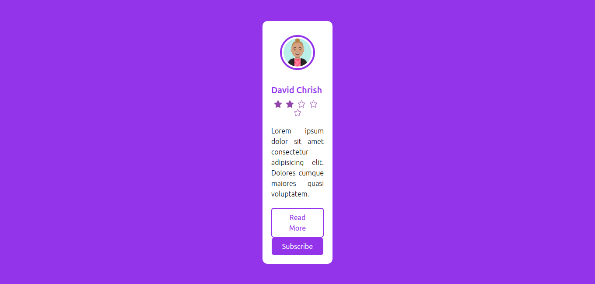
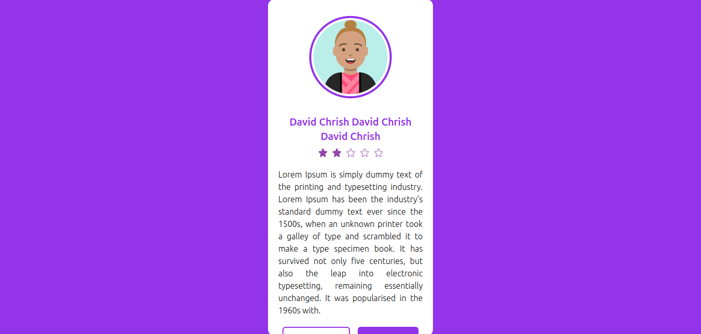

### CARD 11
****

#### A. Design

****

#### B. Width
##### 1. Width standard

##### 2. Width x2

##### 3. Width 1/2

****

#### B. Content
##### 1. Width standard (content long)

##### 2. Width standard (content short)

