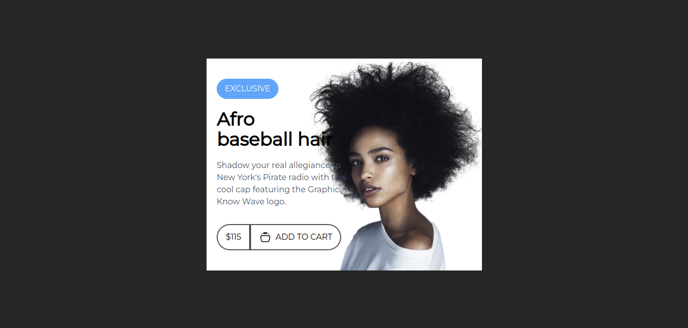
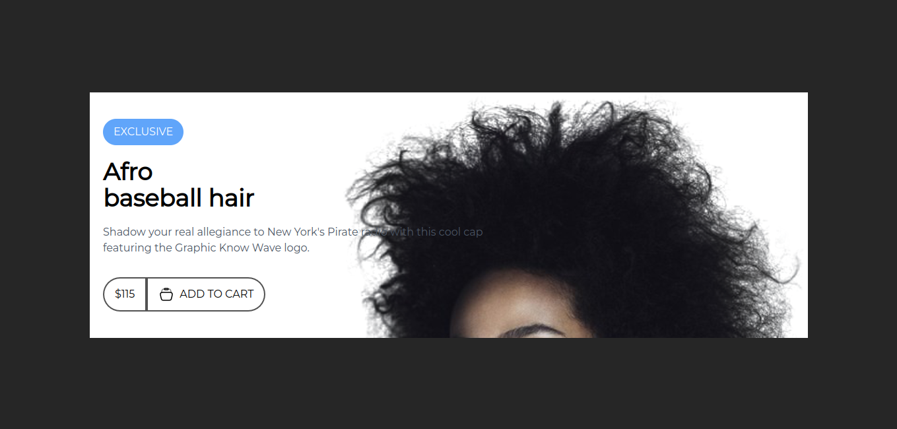
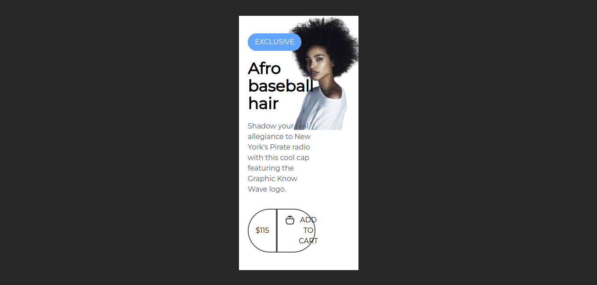
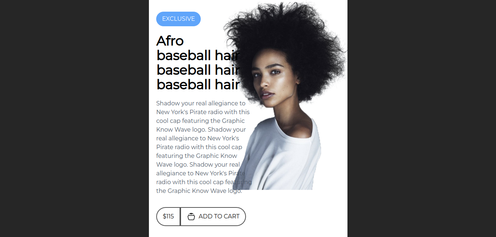
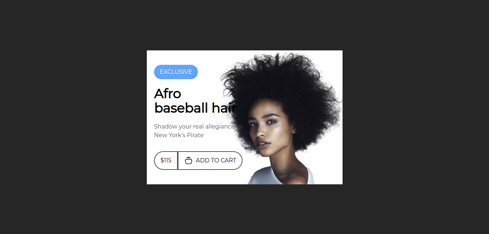

### CARD 24
****

#### A. Design


****

#### B. Width
##### 1. Width standard



##### 2. Width x2



##### 3. Width 1/2



****

#### B. Content
##### 1. Width standard (content long)




##### 2. Width standard (content short)



#### C. Question corner

card nay lam chay duoc nhung kho hieu khi dung position; lam sao de position giua ```left``` va ```right``` co the nam theo ty le cua minh muon khi dung chung voi ```flex```
